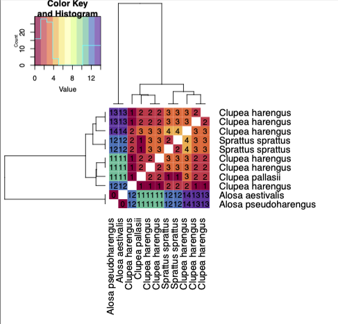

# fishtools
Tools for metabarcoding fish

Use SpeciesPrimerEval_cl to run from the command line

ex:
conda create --name qiime2R --file qiime2R.list.txt
conda activate qiime2R
chmod +x SpeciesPrimerEval_cl/SpeciesPrimerEval.R
## install R packages listed in SpeciesPrimerEval_cl_packages.R
## generate synthetic reads from primer pairs listed in qiime2_primer_amps.sh to provide to rscript
Rscript SpeciesPrimerEval.R 'mifish' 12S-seqs-derep-teleo-seqs.qza 12S-tax-derep-uniq.qza 'herring' fish.txt  

### Example plot

